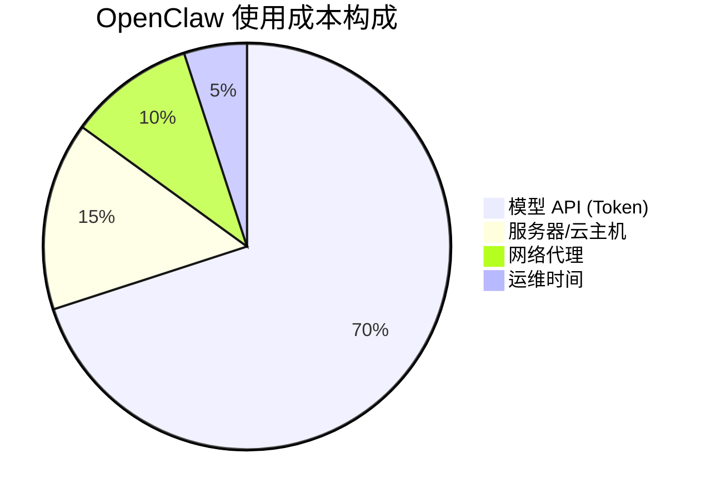
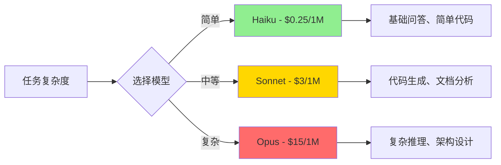
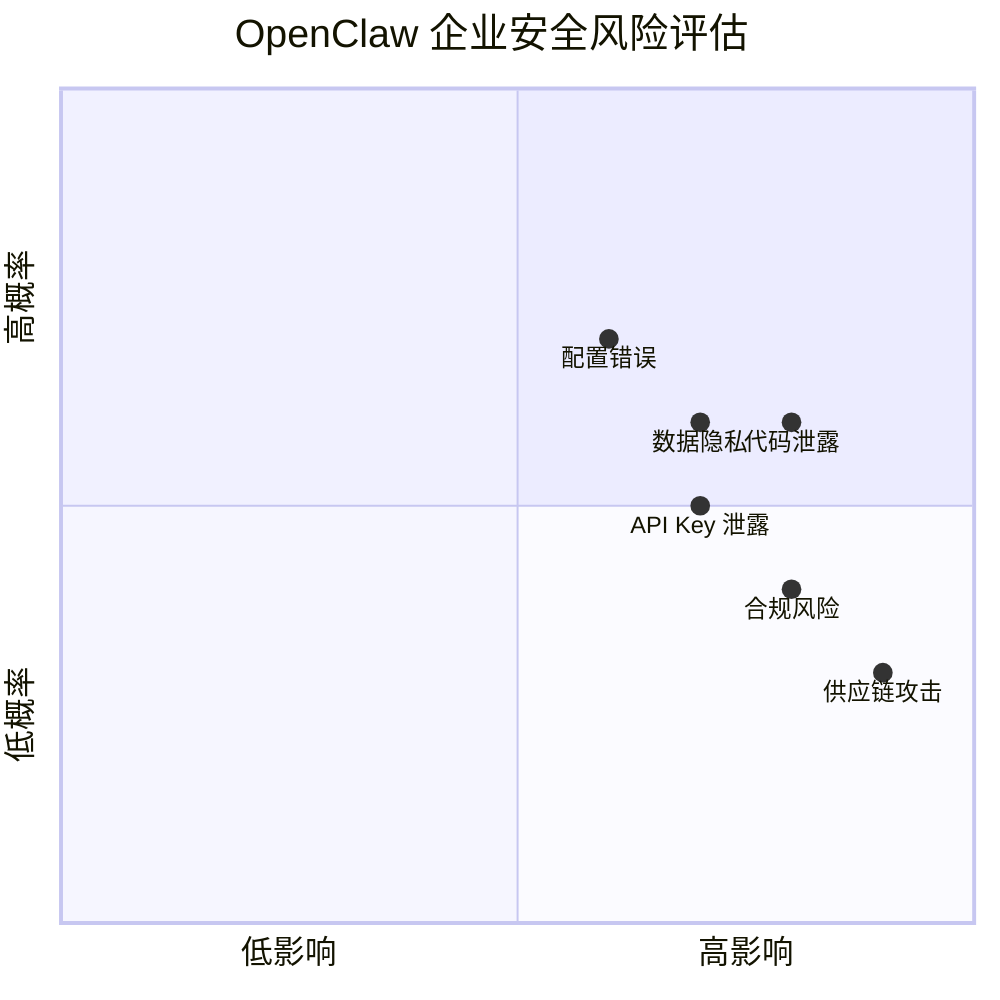
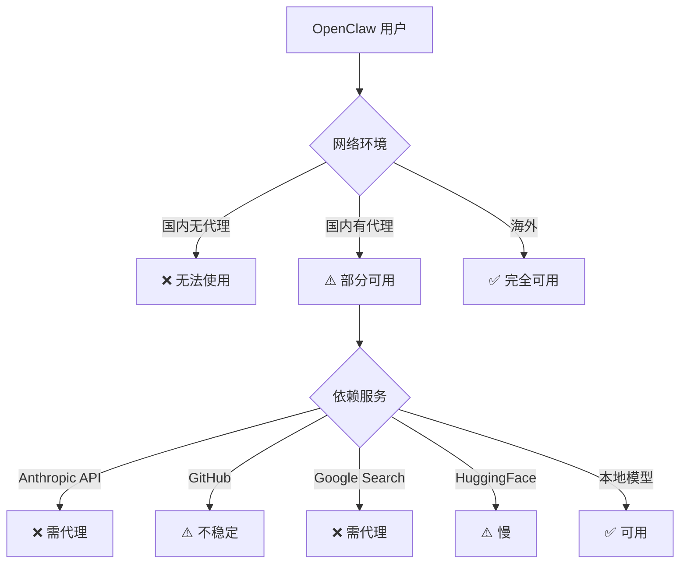
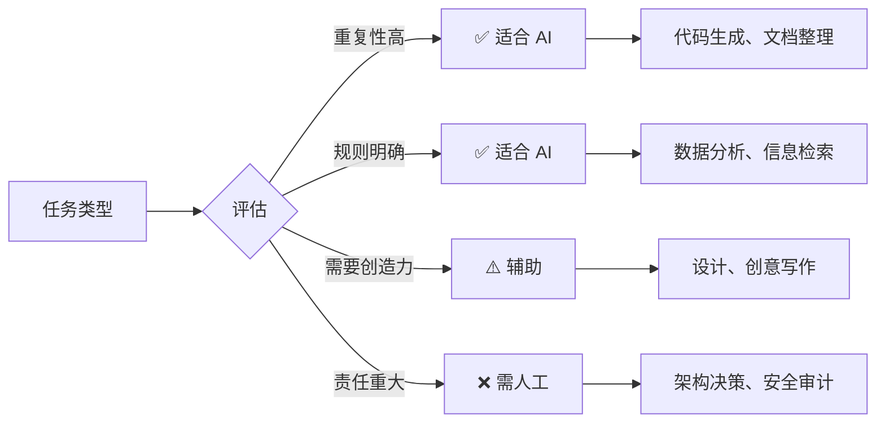
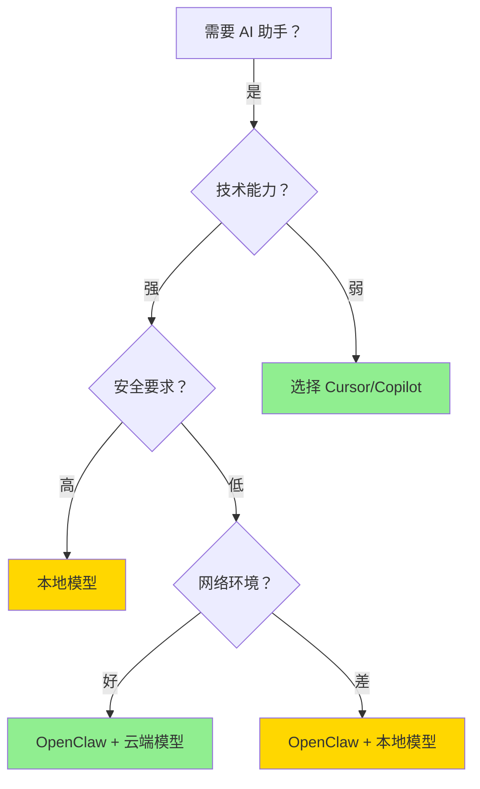

## 引言：热潮背后的冷静思考

2025-2026 年，AI 编程助手市场迎来爆发式增长。OpenClaw 作为 Claude Code 的开源替代方案，凭借其强大的自动化能力和灵活的配置选项，在开发者社区中获得了广泛关注。

然而，在实际部署和使用过程中，我们发现许多管理者和开发者对 OpenClaw 存在**过度期待**和**认知误区**。本文旨在提供一个客观、平衡的视角，帮助用户理解 OpenClaw 的真实能力、使用成本和适用场景。

---

## 一、安装配置复杂度：被低估的门槛

### 1.1 技术门槛数据

| 任务 | 预计时间 | 所需技能 | 失败率 (估算) |
|------|---------|---------|-------------|
| 基础安装 (Docker) | 30-60 分钟 | Linux 基础、Docker | ~20% |
| 配置文件编辑 | 1-2 小时 | JSON/YAML、API 配置 | ~35% |
| 渠道集成 (Discord/Telegram) | 1-3 小时 | Bot 配置、Webhook | ~40% |
| 技能 (Skills) 部署 | 2-4 小时 | Git、Python/Node.js | ~50% |
| 网络代理配置 (国内) | 1-2 小时 | 代理、DNS | ~60% |
| **总部署时间** | **8-15 小时** | **多项技能组合** | **~70%** |

> 注：失败率指首次尝试遇到阻碍需要查阅文档或寻求帮助的比例

### 1.2 与普通软件的对比

| 软件类型 | 安装时间 | 配置复杂度 | 首次使用时间 |
|---------|---------|-----------|------------|
| Microsoft Office | 5-10 分钟 | ⭐ | 即时 |
| Slack/Discord | 2-5 分钟 | ⭐ | 即时 |
| GitHub Copilot | 5-15 分钟 | ⭐⭐ | 10 分钟 |
| Cursor IDE | 10-20 分钟 | ⭐⭐ | 30 分钟 |
| **OpenClaw** | **2-4 小时** | **⭐⭐⭐⭐** | **1-2 天** |
| Self-hosted GitLab | 1-2 小时 | ⭐⭐⭐ | 半天 |

### 1.3 真实案例

**案例 A - 中小企业尝试**：
> 某 50 人技术团队，CTO 决定引入 OpenClaw 提升开发效率。结果：
> - IT 部门花费 3 天完成基础部署
> - 配置渠道集成又用了 2 天
> - 最终只有 5 名高级开发者成功使用
> - 普通开发者因配置复杂放弃
> - **ROI**: 负（投入时间 > 节省时间）

**案例 B - 个人开发者**：
> 资深开发者，有 Linux 和 Docker 经验：
> - 周末花费 6 小时完成部署
> - 第 2 周开始感受到效率提升
> - 第 1 个月后日均节省 1-2 小时
> - **ROI**: 正（约 3 周回本）

### 1.4 结论

**OpenClaw 不适合**：
- ❌ 无 Linux/Docker 经验的团队
- ❌ 期望"开箱即用"的用户
- ❌ 没有专职运维的小团队
- ❌ 需要快速见效的短期项目

**OpenClaw 适合**：
- ✅ 有技术实力的开发者
- ✅ 愿意投入时间学习的用户
- ✅ 长期使用的场景
- ✅ 需要高度定制化的团队

---

## 二、Token 成本：隐形的持续支出

### 2.1 成本结构分析

OpenClaw 本身免费（开源），但**每次使用都消耗 Token**。以下是实际使用成本估算：



### 2.2 实际 Token 消耗数据

基于 2026 年 2 月实际使用记录（单用户）：

| 使用场景 | 日均请求数 | 平均 Token/请求 | 日均消耗 | 月度成本 (Claude Sonnet) |
|---------|-----------|---------------|---------|------------------------|
| 简单问答 | 20 | 2K | 40K | ~$4 |
| 代码生成 | 10 | 10K | 100K | ~$10 |
| 复杂调研 | 2 | 50K | 100K | ~$10 |
| 深度分析 | 1 | 100K | 100K | ~$10 |
| **总计** | **33** | **-** | **340K** | **~$34/月** |

> 注：基于 Claude Sonnet 4.5 定价 ($3/$15 per 1M input/output tokens)

### 2.3 与竞品成本对比

| 工具 | 月费 | 包含额度 | 超出成本 | 适合人群 |
|------|------|---------|---------|---------|
| GitHub Copilot | $10 | 无限 | - | 普通开发者 |
| Cursor (Pro) | $20 | 无限 (慢速) | $10/月 (快速) | 中级开发者 |
| Claude Pro | $20 | 有限 | 需升级 | 轻度用户 |
| **OpenClaw (Sonnet)** | **~$34** | **按量付费** | **多用多付** | **重度用户** |
| OpenClaw (Opus) | ~$120 | 按量付费 | 多用多付 | 专业用户 |
| 自建 + 开源模型 | ~$50 | 无限 | 电费/GPU | 技术团队 |

### 2.4 成本优化策略

**降低 Token 消耗的方法**：
1. 使用较小的模型处理简单任务（Haiku vs Opus）
2. 优化 Prompt，减少不必要的上下文
3. 使用 Prompt Caching（可节省 90% 成本）
4. 批量处理任务，减少重复请求
5. 本地运行小模型（Ollama + Llama）

**实际案例**：
> 某团队通过以下优化，月度 Token 成本从 $150 降至 $45：
> - 启用 Prompt Caching：-60%
> - 简单任务用 Haiku：-20%
> - 优化 Prompt 长度：-10%

### 2.5 结论

**成本警示**：
- ⚠️ OpenClaw 不是"免费"的，Token 成本可能超过商业软件
- ⚠️ 重度用户月成本可达 $100-300
- ⚠️ 需要监控和 optimization，否则成本失控

**成本优势场景**：
- ✅ 可以根据任务选择不同价位的模型
- ✅ 支持 Prompt Caching 大幅降低成本
- ✅ 可以使用本地模型进一步降低成本
- ✅ 多用户共享部署，摊薄固定成本

---

## 三、能力边界：模型智力决定天花板

### 3.1 能力与模型的关系



### 3.2 不同模型的能力对比

| 能力维度 | Haiku | Sonnet | Opus | 人类专家 |
|---------|-------|--------|------|---------|
| 代码补全 | ⭐⭐⭐ | ⭐⭐⭐⭐ | ⭐⭐⭐⭐⭐ | ⭐⭐⭐⭐⭐ |
| 复杂推理 | ⭐⭐ | ⭐⭐⭐ | ⭐⭐⭐⭐ | ⭐⭐⭐⭐⭐ |
| 领域知识 | ⭐⭐⭐ | ⭐⭐⭐⭐ | ⭐⭐⭐⭐ | ⭐⭐⭐⭐⭐ |
| 创造力 | ⭐⭐ | ⭐⭐⭐ | ⭐⭐⭐⭐ | ⭐⭐⭐⭐⭐ |
| 准确性 | ⭐⭐⭐ | ⭐⭐⭐⭐ | ⭐⭐⭐⭐ | ⭐⭐⭐⭐⭐ |
| 成本效率 | ⭐⭐⭐⭐⭐ | ⭐⭐⭐⭐ | ⭐⭐ | ⭐⭐⭐ |

### 3.3 能力限制的真实案例

**案例 1 - 领域知识不足**：
> 任务：分析某特定行业（如医疗设备）的合规要求
> 
> 结果：
> - Haiku: 完全无法理解专业术语
> - Sonnet: 给出通用建议，缺乏行业针对性
> - Opus: 能提供框架，但仍需人工核实
> - **结论**: AI 无法替代领域专家

**案例 2 - 复杂逻辑错误**：
> 任务：生成一个多步骤的数据处理流程
> 
> 结果：
> - 生成的代码逻辑有细微错误
> - 需要人工 review 和修正
> - 节省时间约 30%，但质量风险增加
> - **结论**: AI 生成 ≠ 生产就绪

**案例 3 - 上下文限制**：
> 任务：分析一个 10 万行代码的项目
> 
> 结果：
> - 即使使用 200K context 窗口，也无法完整理解
> - 需要分多次处理，丢失全局视角
> - **结论**: 大项目仍需人工架构师

### 3.4 结论

**能力认知**：
- ⚠️ AI 助手是"增强"工具，不是"替代"工具
- ⚠️ 模型智力有上限，复杂任务仍需人工
- ⚠️ 便宜模型适合简单任务，贵模型适合复杂任务
- ⚠️ 领域知识、创造力、责任承担仍需人类

---

## 四、企业安全：被忽视的重大风险

### 4.1 安全风险矩阵



### 4.2 具体风险场景

#### 风险 1: 代码和敏感信息泄露

**场景**：
```
开发者 → OpenClaw → 外部 API (Anthropic/OpenAI)
        ↓
    上传代码片段、API Key、数据库连接字符串
```

**真实案例**：
> 2025 年某科技公司：
> - 开发者在 Prompt 中粘贴了数据库密码
> - 密码被发送到外部 API
> - API 日志被泄露，导致数据泄露
> - **损失**: $2M+，声誉受损

**缓解措施**：
- ✅ 使用本地模型处理敏感代码
- ✅ 配置敏感信息过滤
- ✅ 审计所有外发请求
- ✅ 使用私有化部署的模型

#### 风险 2: 供应链攻击

**场景**：
```
OpenClaw Skills (第三方) → 恶意代码 → 执行系统命令
```

**风险点**：
- 第三方 Skills 可能包含恶意代码
- `exec` 工具允许执行任意命令
- 默认配置可能过于宽松

**缓解措施**：
- ✅ 只使用可信来源的 Skills
- ✅ 审查 Skills 代码
- ✅ 限制 `exec` 工具的权限
- ✅ 使用沙箱隔离

#### 风险 3: 配置错误导致暴露

**常见错误**：
```yaml
# ❌ 错误配置 - 允许所有频道
channels:
  discord:
    groupPolicy: "allow"  # 应该用 "allowlist"

# ❌ 错误配置 - 无工具限制
tools:
  allow: ["*"]  # 应该明确列出允许的工具

# ✅ 正确配置
channels:
  discord:
    groupPolicy: "allowlist"
    allowFrom: ["channel_id_1", "channel_id_2"]
tools:
  allow: ["read", "web_search"]
  deny: ["exec", "write", "edit"]
```

### 4.3 合规风险

| 行业 | 合规要求 | OpenClaw 风险 | 缓解难度 |
|------|---------|-------------|---------|
| 金融 | SOC 2, PCI-DSS | 高（数据出境） | 困难 |
| 医疗 | HIPAA | 高（患者数据） | 困难 |
| 政府 | FedRAMP | 极高（数据主权） | 极困难 |
| 教育 | FERPA | 中（学生数据） | 中等 |
| 科技 | 一般 | 中（知识产权） | 中等 |

### 4.4 结论

**企业采用建议**：

**❌ 不建议采用**：
- 处理敏感数据（金融、医疗、政府）
- 有严格合规要求的行业
- 没有专职安全团队的中小企业

**✅ 可以考虑**：
- 科技公司（非敏感业务）
- 有安全团队可以审计配置
- 使用本地模型 + 私有化部署
- 严格的工具权限控制

---

## 五、国内使用：网络障碍的现实

### 5.1 网络依赖图



### 5.2 必需的网络服务

| 服务 | 用途 | 国内访问 | 解决方案 |
|------|------|---------|---------|
| Anthropic API | Claude 模型 | ❌ 封锁 | 代理/国内镜像 |
| OpenAI API | GPT 模型 | ❌ 封锁 | 代理/国内镜像 |
| GitHub | Skills/配置 | ⚠️ 不稳定 | 镜像/本地缓存 |
| Google Search | 网络搜索 | ❌ 封锁 | SearxNG/代理 |
| HuggingFace | 开源模型 | ⚠️ 慢 | 镜像站 |
| Discord/Telegram | 消息渠道 | ⚠️ 不稳定 | 代理/改用微信 |

### 5.3 网络成本

| 方案 | 月成本 | 稳定性 | 速度 | 推荐度 |
|------|-------|-------|------|-------|
| 商业 VPN | $5-15 | ⭐⭐⭐ | ⭐⭐⭐ | ⭐⭐⭐ |
| 自建代理 | $10-30 | ⭐⭐⭐⭐ | ⭐⭐⭐⭐ | ⭐⭐⭐⭐ |
| 国内镜像 | 免费 -$10 | ⭐⭐ | ⭐⭐⭐ | ⭐⭐ |
| 本地模型 | $50+ (电费) | ⭐⭐⭐⭐⭐ | ⭐⭐⭐⭐⭐ | ⭐⭐⭐⭐ |

### 5.4 结论

**国内用户建议**：

**必须解决**：
- ✅ 稳定的代理服务（月成本 $10-30）
- ✅ 或使用本地模型（Ollama + Qwen/Llama）
- ✅ 配置 SearxNG 替代 Google Search

**可选优化**：
- 使用国内镜像源（GitHub、HuggingFace）
- 考虑微信/钉钉集成（替代 Discord/Telegram）
- 本地缓存常用 Skills 和配置

---

## 六、能力边界：不是万能工具

### 6.1 适用场景 vs 不适用场景



### 6.2 实际效率对比

| 任务类型 | 纯人工 | AI 辅助 | 效率提升 | 质量风险 |
|---------|-------|--------|---------|---------|
| 简单代码生成 | 100% | 30% | ⬆️ 70% | 低 |
| 文档整理 | 100% | 40% | ⬆️ 60% | 低 |
| 数据分析 | 100% | 50% | ⬆️ 50% | 中 |
| 复杂调试 | 100% | 70% | ⬆️ 30% | 中 |
| 架构设计 | 100% | 80% | ⬆️ 20% | 高 |
| 安全审计 | 100% | 90% | ⬆️ 10% | 极高 |
| 创意工作 | 100% | 60% | ⬆️ 40% | 中 |

> 注：百分比表示人工参与程度，越低表示 AI 自动化程度越高

### 6.3 用户能力的影响

**关键发现**：

> **AI 助手的效率提升 ≈ 用户自身能力 × AI 能力**

**案例对比**：

| 用户类型 | 无 AI | 有 AI | 提升 | 原因 |
|---------|------|------|------|------|
| 初级开发者 | 10 任务/天 | 12 任务/天 | +20% | 需要大量 review AI 输出 |
| 中级开发者 | 20 任务/天 | 35 任务/天 | +75% | 能有效利用 AI，快速识别错误 |
| 高级开发者 | 30 任务/天 | 60 任务/天 | +100% | AI 处理琐事，专注高价值工作 |
| 非技术人员 | 5 任务/天 | 3 任务/天 | -40% | 无法有效使用，反而增加负担 |

### 6.4 结论

**效率提升的前提**：
- ⚠️ 用户需要具备足够的领域知识
- ⚠️ 用户需要能够识别 AI 输出的错误
- ⚠️ 用户需要知道如何有效提问（Prompt Engineering）
- ⚠️ AI 是"能力放大器"，不是"能力创造器"

---

## 七、决策框架：是否应该采用 OpenClaw？

### 7.1 适用性评分卡

| 维度 | 问题 | 是 (+1) | 否 (0) |
|------|------|--------|-------|
| **技术能力** | 团队有 Linux/Docker 经验？ | +1 | 0 |
| **时间投入** | 愿意投入 10+ 小时学习配置？ | +1 | 0 |
| **使用频率** | 日均使用次数 > 10 次？ | +1 | 0 |
| **成本承受** | 能接受月成本 $50-200？ | +1 | 0 |
| **安全要求** | 无严格合规要求？ | +1 | 0 |
| **网络环境** | 有稳定代理或本地模型？ | +1 | 0 |
| **用户能力** | 用户能有效使用 AI 工具？ | +1 | 0 |
| **长期规划** | 计划使用 6 个月以上？ | +1 | 0 |

**评分结果**：
- **7-8 分**: ✅ 强烈推荐
- **5-6 分**: ⚠️ 可以考虑，注意风险
- **3-4 分**: ❌ 不建议，成本可能超过收益
- **0-2 分**: ❌❌ 强烈不建议

### 7.2 替代方案对比

| 需求 | OpenClaw | Cursor | GitHub Copilot | 本地模型 |
|------|---------|--------|---------------|---------|
| 开箱即用 | ⭐ | ⭐⭐⭐⭐⭐ | ⭐⭐⭐⭐⭐ | ⭐⭐⭐ |
| 定制化 | ⭐⭐⭐⭐⭐ | ⭐⭐⭐ | ⭐ | ⭐⭐⭐⭐ |
| 成本 | ⭐⭐ | ⭐⭐⭐⭐ | ⭐⭐⭐⭐ | ⭐⭐⭐⭐⭐ |
| 隐私 | ⭐⭐ | ⭐⭐⭐ | ⭐⭐⭐ | ⭐⭐⭐⭐⭐ |
| 能力 | ⭐⭐⭐⭐⭐ | ⭐⭐⭐⭐ | ⭐⭐⭐ | ⭐⭐⭐ |
| 国内可用 | ⭐⭐ | ⭐⭐⭐ | ⭐⭐ | ⭐⭐⭐⭐⭐ |

### 7.3 推荐决策树



---

## 八、结论与建议

### 8.1 核心观点总结

1. **OpenClaw 不是"银弹"**
   - 安装配置复杂度高（8-15 小时）
   - Token 成本可能超过商业软件（$30-200/月）
   - 能力受限于模型智力和用户能力

2. **OpenClaw 有明确优势场景**
   - 需要高度定制化的团队
   - 有技术实力自行部署和维护
   - 重度用户（日均使用 > 10 次）
   - 长期使用（6 个月以上）

3. **OpenClaw 有明显限制**
   - 不适合无技术背景的用户
   - 不适合有严格合规要求的企业
   - 国内使用需要解决网络问题
   - 不能替代人类专家的判断和责任

### 8.2 给管理者的建议

**❌ 不要**：
- 期望"部署即见效"
- 强制所有员工使用
- 忽视安全和合规风险
- 低估培训和配置成本

**✅ 应该**：
- 先小范围试点（3-5 人）
- 提供充分的技术支持
- 建立使用规范和审计机制
- 持续监控成本和 ROI

### 8.3 给开发者的建议

**适合采用 OpenClaw，如果**：
- ✅ 你享受折腾配置和定制
- ✅ 你有足够的领域知识识别 AI 错误
- ✅ 你愿意学习 Prompt Engineering
- ✅ 你能承担月成本 $50-200

**不适合采用 OpenClaw，如果**：
- ❌ 你只想"开箱即用"
- ❌ 你没有时间学习配置
- ❌ 你无法判断 AI 输出的质量
- ❌ 你对成本敏感

### 8.4 最终建议

> **OpenClaw 是一个强大的工具，但只适合特定的人群和场景。**
>
> **理性评估，谨慎采用，持续优化。**

---

## 附录：参考资源

### A. 官方资源
- OpenClaw 文档：https://docs.openclaw.ai
- OpenClaw GitHub: https://github.com/openclaw/openclaw
- Claude Code: https://claude.ai/code

### B. 成本计算工具
- Token Calculator: https://tokencalculator.ai
- LLM Pricing Compare: https://pricepertoken.com

### C. 安全配置指南
- OpenClaw 安全最佳实践：https://docs.openclaw.ai/gateway/sandboxing
- 多 Agent 沙箱配置：https://docs.openclaw.ai/tools/multi-agent-sandbox-tools

### D. 国内替代方案
- Ollama (本地模型): https://ollama.ai
- SearxNG (自建搜索): https://searxng.org
- Qwen Model (阿里开源): https://github.com/QwenLM/Qwen

---

*本文基于实际使用经验和公开数据，力求客观准确。由于技术快速发展，部分数据可能随时间变化。建议读者在使用前进行独立验证。*

*不构成投资或采用建议，请根据自身情况做出决策。*
